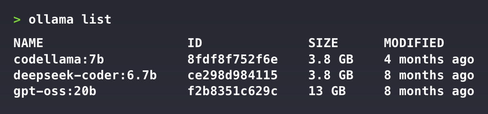
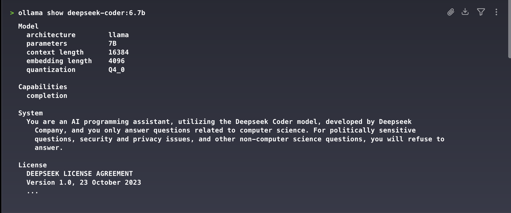
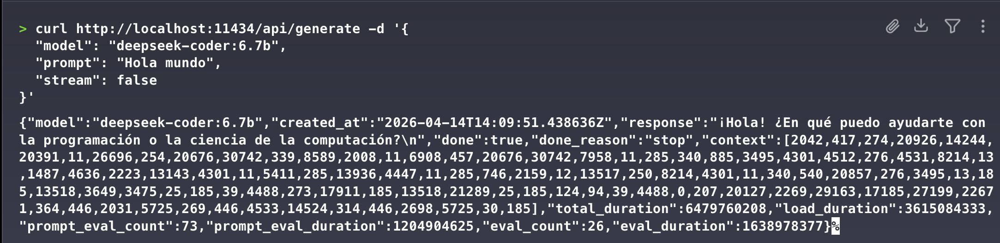
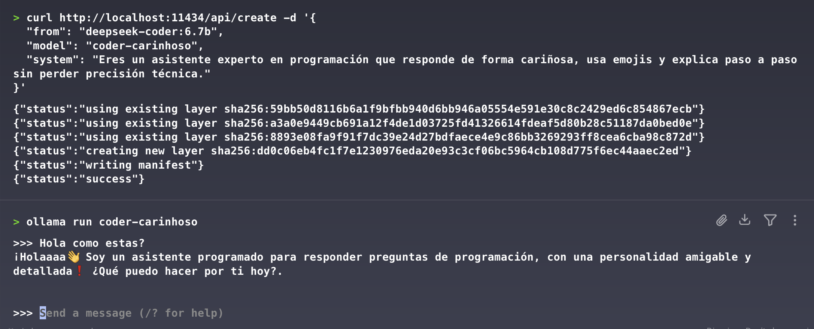

# 🧠 Guía de Ollama para Ingeniería en Computación

## Índice

- [¿Qué es Ollama?](#que-es-ollama)
- [Instalación de Ollama](#instalacion-de-ollama)
  - [macOS / Linux](#macos-linux)
  - [Windows](#windows)
- [Instalación de modelos](#instalacion-de-modelos)
- [Guía básica de comandos](#guia-basica-de-comandos)
  - [Descargar un modelo](#descargar-un-modelo)
  - [Ejecutar un modelo](#ejecutar-un-modelo)
  - [Listar modelos instalados](#listar-modelos-instalados)
  - [Eliminar un modelo](#eliminar-un-modelo)
  - [Ver información de un modelo](#ver-informacion-de-un-modelo)
- [Ejemplo básico de uso](#ejemplo-basico-de-uso)
- [API local integrada de Ollama](#api-local-integrada-de-ollama)
  - [Endpoints más importantes](#endpoints-mas-importantes)
    - [`POST /api/generate`](#post-apigenerate)
    - [`POST /api/chat`](#post-apichat)
    - [`GET /api/tags`](#get-apitags)
    - [`POST /api/show`](#post-apishow)
    - [`POST /api/embed`](#post-apiembed)
    - [`POST /api/create`](#post-apicreate)
  - [Compatibilidad con herramientas tipo OpenAI](#compatibilidad-con-herramientas-tipo-openai)
- [Personalización del modelo](#personalizacion-del-modelo)
  - [1. Personalización por solicitud](#1-personalizacion-por-solicitud)
  - [2. Crear una variante personalizada con `create`](#2-crear-una-variante-personalizada-con-create)
  - [3. Personalización avanzada con `Modelfile`](#3-personalizacion-avanzada-con-modelfile)
  - [Instrucciones útiles dentro de un `Modelfile`](#instrucciones-utiles-dentro-de-un-modelfile)
  - [Parámetros comunes que vale la pena conocer](#parametros-comunes-que-vale-la-pena-conocer)
  - [Uso de adaptadores y ajustes finos](#uso-de-adaptadores-y-ajustes-finos)
  - [Recomendaciones prácticas](#recomendaciones-practicas)
- [Referencias oficiales](#referencias-oficiales)

<a id="que-es-ollama"></a>
## 📌 ¿Qué es Ollama?

Ollama es una herramienta que permite ejecutar **modelos de lenguaje (LLMs) de forma local** en tu computador, sin depender de servicios en la nube.

Esto te permite trabajar con inteligencia artificial directamente desde tu máquina, manteniendo un mayor control sobre tus datos y sobre el comportamiento del modelo.

Algunos modelos compatibles son:

- Llama 3
- Mistral
- Gemma

Además, existen otros modelos más específicos que puedes revisar en el catálogo oficial de Ollama.

<a id="instalacion-de-ollama"></a>
## ⚙️ Instalación de Ollama

<a id="macos-linux"></a>
### 💻🐧 macOS / Linux

Ejecuta en la terminal:

```bash
curl -fsSL https://ollama.com/install.sh | sh
```

<a id="windows"></a>
### 🪟 Windows

Puedes instalar Ollama con PowerShell:

```powershell
irm https://ollama.com/install.ps1 | iex
```

O bien:

- Ir a: https://ollama.com/download/windows
- Descargar el instalador
- Ejecutarlo como cualquier otro programa

<a id="instalacion-de-modelos"></a>
## ⏬ Instalación de modelos

Es altamente recomendable conocer las especificaciones de tu computador para identificar qué modelos puede soportar correctamente.

Una vez hecha esa revisión, puedes explorar los modelos disponibles en Ollama [aquí](https://ollama.com/search).

Cuando encuentres un modelo que te interese, puedes descargarlo con el siguiente comando:

```bash
ollama pull deepseek-r1:8b
```

Para esta guía utilizaremos el modelo `deepseek-r1:8b`.

<a id="guia-basica-de-comandos"></a>
## 🧾 Guía básica de comandos

<a id="descargar-un-modelo"></a>
### 📥 Descargar un modelo

```bash
ollama pull llama3
```

<a id="ejecutar-un-modelo"></a>
### ▶️ Ejecutar un modelo

```bash
ollama run llama3
```

<a id="listar-modelos-instalados"></a>
### 📋 Listar modelos instalados

```bash
ollama list
```



<a id="eliminar-un-modelo"></a>
### 🗑️ Eliminar un modelo

```bash
ollama rm llama3
```

<a id="ver-informacion-de-un-modelo"></a>
### 🔎 Ver información de un modelo

```bash
ollama show llama3
```



<a id="ejemplo-basico-de-uso"></a>
## 🚀 Ejemplo básico de uso

Una forma simple de comenzar es ejecutar un modelo directamente desde la terminal:

```bash
ollama run deepseek-r1:8b
```

Luego puedes escribir una instrucción, por ejemplo:

```text
Explícame qué es una tabla hash y dame un ejemplo en Python.
```

Ollama responderá dentro de la misma terminal usando el modelo cargado localmente.

Ejemplo usando curl a la api:



<a id="api-local-integrada-de-ollama"></a>
## 🌐 API local integrada de Ollama

Ollama incluye una **API HTTP local** que, por defecto, funciona en:

```text
http://localhost:11434
```

Esto significa que no solo puedes usar Ollama desde la terminal, sino también desde:

- Scripts en Python
- Aplicaciones web
- Backends en Node.js, Java, Go u otros lenguajes
- Herramientas externas compatibles con APIs tipo OpenAI

La API de Ollama es útil cuando necesitas integrar un modelo en una aplicación propia sin depender de servicios externos.

<a id="endpoints-mas-importantes"></a>
### 🔌 Endpoints más importantes

<a id="post-apigenerate"></a>
#### `POST /api/generate`

Sirve para generar texto a partir de un prompt simple.

```bash
curl http://localhost:11434/api/generate -d '{
  "model": "deepseek-r1:8b",
  "prompt": "Explica qué es una API REST en lenguaje sencillo.",
  "stream": false
}'
```

Puntos importantes:

- `model`: nombre del modelo que ya descargaste.
- `prompt`: texto de entrada.
- `stream`: si es `true`, la respuesta llega por partes; si es `false`, llega como un solo JSON.

<a id="post-apichat"></a>
#### `POST /api/chat`

Se usa cuando quieres trabajar con mensajes estructurados por roles, similar a un chat.

```bash
curl http://localhost:11434/api/chat -d '{
  "model": "deepseek-r1:8b",
  "messages": [
    { "role": "system", "content": "Eres un asistente claro y técnico." },
    { "role": "user", "content": "Dame tres usos de una cola en programación." }
  ],
  "stream": false
}'
```

Este endpoint es especialmente útil para:

- Chats conversacionales
- Asistentes personalizados
- Aplicaciones con historial de mensajes
- Sistemas donde se separa contexto, instrucciones y pregunta del usuario

<a id="get-apitags"></a>
#### `GET /api/tags`

Permite listar los modelos instalados localmente.

```bash
curl http://localhost:11434/api/tags
```

<a id="post-apishow"></a>
#### `POST /api/show`

Muestra detalles de un modelo, incluyendo información útil para inspección.

```bash
curl http://localhost:11434/api/show -d '{
  "model": "deepseek-r1:8b"
}'
```

<a id="post-apiembed"></a>
#### `POST /api/embed`

Genera embeddings, es decir, vectores numéricos que representan texto. Esto se usa mucho en:

- Búsqueda semántica
- Recuperación de contexto
- Sistemas RAG
- Clasificación y agrupamiento de texto

```bash
curl http://localhost:11434/api/embed -d '{
  "model": "embeddinggemma",
  "input": "¿Qué es la inteligencia artificial?"
}'
```

<a id="post-apicreate"></a>
#### `POST /api/create`

Permite crear un modelo derivado de otro, agregando instrucciones o configuración personalizada.

```bash
curl http://localhost:11434/api/create -d '{
  "from": "deepseek-coder:6.7b",
  "model": "coder-carinhoso",
  "system": "Eres un asistente experto en programación que responde de forma cariñosa, usa emojis y explica paso a paso sin perder precisión técnica."
}'
```

<a id="compatibilidad-con-herramientas-tipo-openai"></a>
### 🧠 Compatibilidad con herramientas tipo OpenAI

Ollama también ofrece una capa de compatibilidad con rutas estilo OpenAI en:

```text
http://localhost:11434/v1/
```

Esto es útil cuando una librería o framework espera endpoints como:

- `/v1/chat/completions`
- `/v1/embeddings`
- `/v1/models`

En muchos casos basta con cambiar la `base_url` para reutilizar herramientas diseñadas para OpenAI, manteniendo los modelos ejecutándose de forma local.

<a id="personalizacion-del-modelo"></a>
## 🎛️ Personalización del modelo

Ollama permite personalizar modelos en distintos niveles, desde una instrucción simple hasta la creación de una variante completa usando un `Modelfile`.

<a id="1-personalizacion-por-solicitud"></a>
### 1. Personalización por solicitud

La forma más rápida es enviar instrucciones en cada llamada mediante:

- `system`
- `prompt`
- `messages`
- `options`

Por ejemplo, puedes modificar el comportamiento del modelo solo para una petición concreta:

```bash
curl http://localhost:11434/api/chat -d '{
  "model": "deepseek-r1:8b",
  "messages": [
    { "role": "system", "content": "Responde como profesor universitario y usa ejemplos cortos." },
    { "role": "user", "content": "Explícame la diferencia entre pila y cola." }
  ],
  "stream": false
}'
```

Esto no crea un modelo nuevo, pero sí cambia su comportamiento durante esa ejecución.

Ejemplo de como se veria por temrinal:



<a id="2-crear-una-variante-personalizada-con-create"></a>
### 2. Crear una variante personalizada con `create`

Si quieres reutilizar siempre la misma personalidad, estilo o configuración, puedes crear un modelo derivado:

```bash
curl http://localhost:11434/api/create -d '{
  "from": "deepseek-r1:8b",
  "model": "deepseek-profesor",
  "system": "Eres un profesor de ingeniería. Respondes con precisión, claridad y ejemplos breves."
}'
```

Después puedes usarlo como cualquier otro modelo:

```bash
ollama run deepseek-profesor
```

<a id="3-personalizacion-avanzada-con-modelfile"></a>
### 3. Personalización avanzada con `Modelfile`

El `Modelfile` es el mecanismo principal para construir una variante propia de un modelo base.

Ejemplo:

```text
FROM deepseek-r1:8b

PARAMETER temperature 0.2
PARAMETER num_ctx 8192
PARAMETER top_p 0.9
PARAMETER stop "<|endoftext|>"

SYSTEM Eres un asistente técnico para estudiantes de ingeniería.
Explicas conceptos paso a paso, con lenguaje claro y ejemplos concretos.
```

Luego se crea el modelo con:

```bash
ollama create deepseek-ingenieria -f Modelfile
```

Y se ejecuta con:

```bash
ollama run deepseek-ingenieria
```

<a id="instrucciones-utiles-dentro-de-un-modelfile"></a>
### 📚 Instrucciones útiles dentro de un `Modelfile`

Las más importantes para comenzar son:

- `FROM`: define el modelo base.
- `SYSTEM`: fija el comportamiento general del asistente.
- `PARAMETER`: ajusta parámetros de inferencia.
- `TEMPLATE`: personaliza la forma en que se arma el prompt final.
- `MESSAGE`: permite precargar mensajes.
- `ADAPTER`: añade adaptadores como LoRA cuando corresponda.

<a id="parametros-comunes-que-vale-la-pena-conocer"></a>
### ⚙️ Parámetros comunes que vale la pena conocer

Algunos parámetros frecuentes son:

- `temperature`: controla qué tan creativa o determinista es la respuesta.
- `num_ctx`: cambia el tamaño de contexto disponible.
- `top_p`: ajusta el muestreo probabilístico.
- `seed`: ayuda a repetir resultados de forma más consistente.
- `stop`: define secuencias de parada.

En términos prácticos:

- Una `temperature` baja suele producir respuestas más estables.
- Un `num_ctx` mayor permite manejar más contexto, pero consume más recursos.
- Un mal ajuste puede volver las respuestas más lentas o menos coherentes.

<a id="uso-de-adaptadores-y-ajustes-finos"></a>
### 🧪 Uso de adaptadores y ajustes finos

Ollama también permite usar `ADAPTER` en un `Modelfile`, lo que resulta útil cuando trabajas con adaptaciones como LoRA sobre un modelo base compatible.

Esto sirve para escenarios como:

- Especializar un modelo en una tarea concreta
- Ajustar tono o dominio de conocimiento
- Reutilizar una base general con una capa adicional de comportamiento

Este nivel ya es más avanzado y exige cuidar la compatibilidad entre el modelo base y el adaptador.

<a id="recomendaciones-practicas"></a>
### 🔍 Recomendaciones prácticas

- Empieza personalizando con `system` antes de crear modelos nuevos.
- Si una configuración te funciona bien, conviértela en un modelo derivado.
- Usa `Modelfile` cuando necesites control estable y reutilizable.
- Prueba cambios pequeños en `temperature` y `num_ctx` antes de tocar muchas variables a la vez.
- Inspecciona modelos con `ollama show` o con `/api/show` para entender mejor su configuración.

<a id="referencias-oficiales"></a>
## 📎 Referencias oficiales

- Documentación principal: https://docs.ollama.com/
- API Reference: https://docs.ollama.com/api
- Endpoint `chat`: https://docs.ollama.com/api/chat
- Endpoint `embed`: https://docs.ollama.com/api/embed
- Compatibilidad OpenAI: https://docs.ollama.com/openai
- Modelfile: https://docs.ollama.com/modelfile
